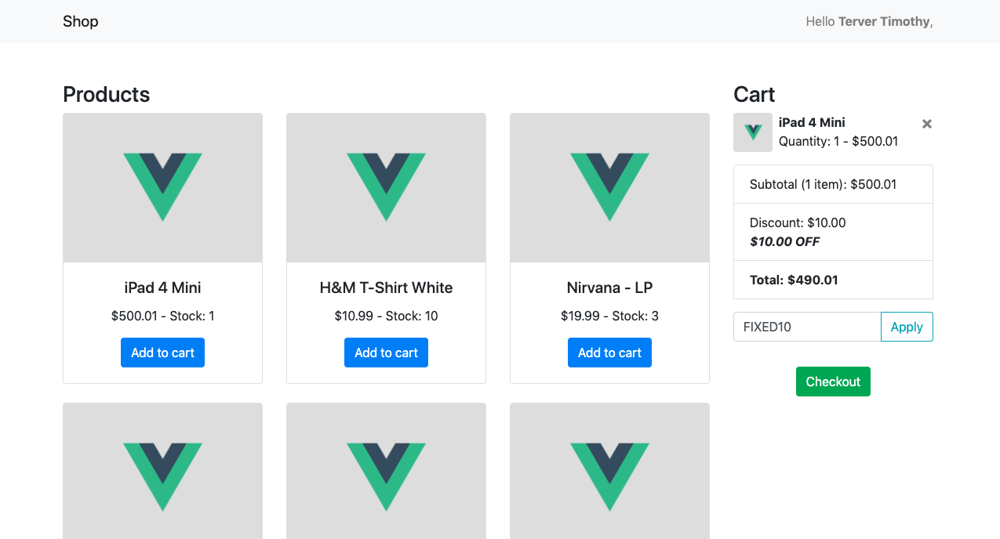

# Fexible Coupon System

# Getting Started

- Install PHP dependencies:

      composer install
      
      
- Install Node dependencies:

      npm install
      

- Add Database:

 
      Create an env file and add your database credentials
 
- Run commands for database migration and seeding
       
      $ php artisan migrate --seed

- Starting the serve
       
      $ php artisan serve
      
     
  Now you can visit http://localhost:8000 in your browser to see the coupon system as displayed in the image below:  
   
   
        
    
   You can test with the following default coupons:
    
    FIXED10
    PERCENT10
    MIXED10
    REJECTED10

